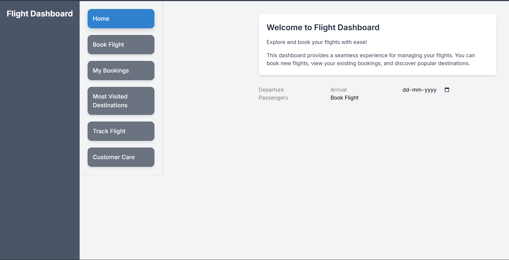

# ✈️ Airline Booking System

A full-stack web application for booking flights, tracking flights, and managing airline reservations. Built with HTML, CSS, JavaScript frontend and PHP backend.



## 📋 Table of Contents
- [Features](#features)
- [Tech Stack](#tech-stack)
- [Project Structure](#project-structure)
- [Installation](#installation)
- [Usage](#usage)
- [Database Setup](#database-setup)
- [API Endpoints](#api-endpoints)
- [Contributing](#contributing)
- [License](#license)

## ✨ Features

- **Flight Booking**: Browse and book flights with ease
- **Flight Tracking**: Real-time flight tracking system
- **Booking Management**: View and manage your bookings
- **Destinations**: Explore available flight destinations
- **Customer Support**: Customer care contact page
- **Responsive Design**: Mobile-friendly interface
- **Database Integration**: PHP backend with MySQL database

## 🛠️ Tech Stack

### Frontend
- HTML5
- CSS3
- JavaScript (Vanilla)

### Backend
- PHP 7.0+
- MySQL 5.7+

### Architecture
- MVC Pattern
- RESTful API endpoints
- Database-driven backend

## 📁 Project Structure

```
airline/
├── airline/                    # Main application folder
│   ├── index.html             # Home page
│   ├── book-flight.html       # Flight booking page
│   ├── my-bookings.html       # User bookings page
│   ├── track-flight.html      # Flight tracking page
│   ├── destinations.html      # Destinations page
│   ├── customer-care.html     # Customer support page
│   ├── airline.png            # Logo/Preview image
│   ├── api.php                # Main API handler
│   ├── book_flight.php        # Flight booking logic
│   ├── process_booking.php    # Booking processor
│   ├── get_bookings.php       # Retrieve bookings
│   ├── get_destinations.php   # Retrieve destinations
│   └── db.php                 # Database connection
├── Airline_booking/           # Organized asset structure
│   ├── html/                  # HTML templates (if needed)
│   ├── css/                   # CSS stylesheets
│   ├── js/                    # JavaScript files
│   ├── php/                   # PHP backend files
│   ├── images/                # Images and assets
│   └── Airline_booking.png    # Preview image
├── LICENSE                    # MIT License
└── README.md                  # This file

```

## 🚀 Installation

### Prerequisites
- Web Server (Apache/Nginx)
- PHP 7.0 or higher
- MySQL 5.7 or higher
- Git

### Setup Steps

1. **Clone the repository**
   ```bash
   git clone https://github.com/Anmol2046S/airline.git
   cd airline
   ```

2. **Configure Database Connection**
   - Edit `airline/db.php` with your database credentials:
   ```php
   $host = "localhost";
   $user = "root";
   $password = "your_password";
   $database = "airline_db";
   ```

3. **Create Database**
   ```sql
   CREATE DATABASE airline_db;
   ```

4. **Import Database Schema**
   ```bash
   mysql -u root -p airline_db < database.sql
   ```

5. **Set up Web Server**
   - Place the project in your web server root directory (htdocs for XAMPP)
   - Access via `http://localhost/airline/airline/index.html`

## 💻 Usage

### Home Page
Navigate to `index.html` to access the main landing page with navigation to all features.

### Booking a Flight
1. Click "Book Flight" from the navigation menu
2. Fill in travel details (departure, destination, date)
3. Select your preferred flight
4. Complete the booking process

### Tracking a Flight
1. Go to "Track Flight" page
2. Enter your flight number
3. View real-time flight status and details

### View My Bookings
1. Access "My Bookings" page
2. View all your confirmed bookings
3. Manage your reservations

### Destinations
Browse available flight destinations and routes offered by the airline.

## 🗄️ Database Setup

### Create Tables

```sql
-- Destinations table
CREATE TABLE destinations (
    id INT PRIMARY KEY AUTO_INCREMENT,
    departure_city VARCHAR(100),
    arrival_city VARCHAR(100),
    departure_time DATETIME,
    arrival_time DATETIME,
    available_seats INT,
    price DECIMAL(10, 2),
    flight_number VARCHAR(20) UNIQUE
);

-- Bookings table
CREATE TABLE bookings (
    id INT PRIMARY KEY AUTO_INCREMENT,
    passenger_name VARCHAR(100),
    flight_id INT,
    booking_date DATETIME DEFAULT CURRENT_TIMESTAMP,
    status VARCHAR(50),
    FOREIGN KEY (flight_id) REFERENCES destinations(id)
);
```

## 🔌 API Endpoints

| Method | Endpoint | Description |
|--------|----------|-------------|
| GET | `/api.php?action=destinations` | Get all destinations |
| GET | `/api.php?action=bookings&id=USER_ID` | Get user bookings |
| POST | `/api.php?action=book` | Create new booking |
| GET | `/api.php?action=track&flight=FLIGHT_NUMBER` | Track flight status |

## 🤝 Contributing

Contributions are welcome! To contribute:

1. Fork the repository
2. Create a feature branch (`git checkout -b feature/AmazingFeature`)
3. Commit changes (`git commit -m 'Add AmazingFeature'`)
4. Push to branch (`git push origin feature/AmazingFeature`)
5. Open a Pull Request

## 📝 License

This project is licensed under the MIT License - see the [LICENSE](LICENSE) file for details.

## 🔗 Links

- **Repository**: https://github.com/Anmol2046S/airline
- **Issues**: https://github.com/Anmol2046S/airline/issues
- **Discussions**: https://github.com/Anmol2046S/airline/discussions

## 📞 Contact & Support

For support, please create an issue in the GitHub repository or check the Customer Care page in the application.

---

**Made with ❤️ by Anmol2046S**
